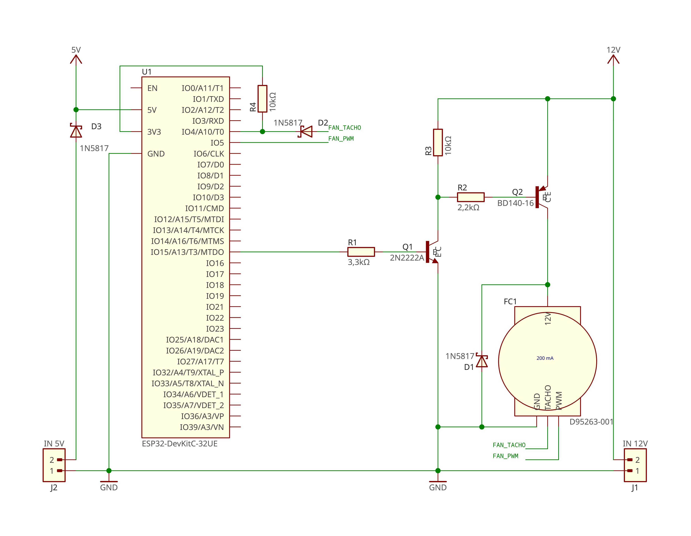
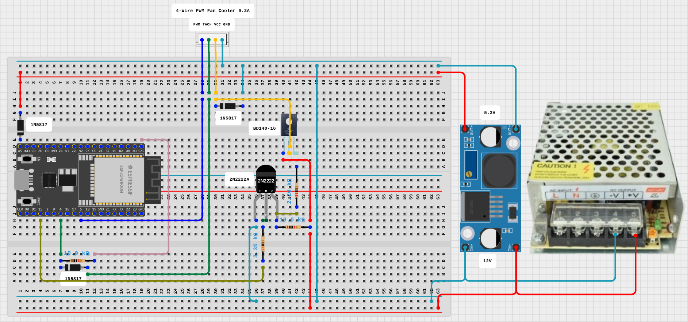

# Controlling the 4-wire PWM fan cooler using ESP32

## Cooler
- 4-Wire Fan Cooler DC 12V 0.2A
- Part number: D95263-001 
- Model number: F09A-12B7S2

Designed for use with Intel LGA775, LGA1155, LGA1150, and LGA1156 socket CPUs

## Board
- ESP32 DevKitC v4

## Power
- 12V power supply
- DC-DC step-down converter LM2596

## Schematics

